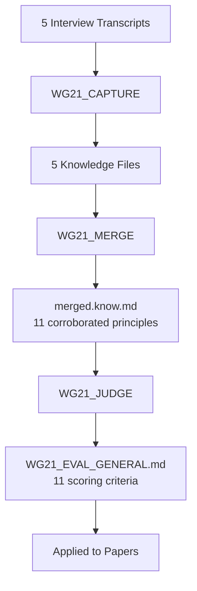

# Saving All Gathered Expertise: WG21-SAGE

## Abstract

WG21 participants have accumulated deep expertise over three decades of C++ standardization. This expertise includes not just technical knowledge but judgment - the ability to evaluate proposals, recognize patterns, and make good decisions in novel situations. Much of this judgment is tacit: easier to demonstrate than to write down.

This paper presents a method for capturing expert judgment through structured interviews, AI-assisted transcription, and knowledge synthesis. We conducted interviews with experienced committee members and processed the results through an agentic workflow. The output is a structured collection of principles and experiences that can be shared, reviewed, and applied.

The technology exists. The methodology is demonstrated. Participation is voluntary.

**Call to action**: Join the paper authors by volunteering to be interviewed.

---

## Revision History

### R0: January 2026

- Initial version with agentic interview proposal and experimental results

---

## 1. Disclosure

**This paper uses AI at every stage.** Interview transcripts were produced by AI transcription. Knowledge synthesis was produced by AI processing. The paper itself was drafted with AI assistance. Every stage involves machine output.

**Human curation is required at every stage.** AI transcription introduces errors. AI synthesis can misattribute, compress, or distort meaning. No output in this paper should be treated as a faithful representation of any interviewee's views without that interviewee's explicit review and approval.

**All presented outputs are illustrative, not normative.** The synthesized principles, the paper evaluations, and the combined-principles rankings reflect one experimental run of a preliminary methodology. They do not represent committee consensus, expert endorsement, or recommended policy.

---

## 2. Knowledge in Engineering Institutions

Engineering institutions accumulate knowledge in two forms: conclusions that can be written down, and judgment that resists documentation.

### 2.1 Judgment Requires Experience

Engineering decisions require judgment, and judgment requires experience. This is true in every engineering discipline. A bridge engineer with thirty years of practice sees failure modes that a recent graduate cannot. The knowledge that separates them is not in any textbook. It was built through decades of seeing what works, what fails, and why.

The same applies to standardization. Evaluating whether a proposal belongs in the C++ standard requires judgment about API design, backward compatibility, implementation cost, and long-term maintenance. This judgment accumulates through direct experience with the standardization process - seeing proposals succeed, seeing proposals fail, and understanding the difference.

### 2.2 Tacit Knowledge

Much of what experienced practitioners know is **tacit knowledge** - understanding that is easier to demonstrate than to write down. A master craftsman applies judgment in novel situations that no rulebook could anticipate. Samo Burja's research on institutional knowledge transmission identifies this as a general property of skilled practice:

> *"Since it cannot be easily transferred via texts, tacit knowledge must be taught via direct practice and extensive interaction with a skilled practitioner."*

When Howard Hinnant evaluates whether a library proposal has sufficient field experience, he draws on decades of implementation experience. When Bjarne Stroustrup assesses whether a language feature maintains coherence with C++'s design philosophy, he applies judgment built over forty years. This knowledge is WG21's most valuable asset.

### 2.3 Living Traditions and Generating Principles

Burja distinguishes between **living traditions** and **dead traditions** of knowledge. A living tradition is one where the underlying understanding has been successfully transferred - not just the procedures, but the judgment behind them. A dead tradition preserves the external forms (documents, procedures, rituals) while the understanding that gave them meaning has been lost.

The difference is familiar to any software engineer. A developer who understands a codebase can extend it faithfully. A developer who copies patterns from it without understanding them will introduce inconsistencies. Both can follow the coding standard. Only one can make good decisions when the standard does not cover the case.

What separates the two is access to **generating principles** - the deep reasoning from which specific decisions derive:

> *"Someone who understands the generating principles of a tradition will be able to verify or check their knowledge, but, more importantly, they will also be able to extend it while remaining faithful to the original body of knowledge."*

Bjarne Stroustrup articulated this concept in his own terms: principles and examples must be "very closely interlaced." A principle without examples cannot be applied. An example without a principle cannot be extended. The combination is what makes knowledge transmissible.

### 2.4 Conclusions and Judgment in WG21

WG21 has created substantial documentation. The question is what that documentation transmits.

**Procedural Documents** tell participants *how the committee operates*:

| Document | Knowledge Transmitted |
|----------|----------------------|
| [SD-3](https://isocpp.org/std/standing-documents/sd-3-study-group-organizational-information), [SD-4](https://isocpp.org/std/standing-documents/sd-4-wg21-practices-and-procedures), [SD-5](https://isocpp.org/std/standing-documents/sd-5-meeting-information) | Procedure, logistics |
| [SD-7](https://isocpp.org/std/standing-documents/sd-7-mailing-procedures-and-how-to-write-papers) | Formatting, submission |
| [How to Submit a Proposal](https://isocpp.org/std/submit-a-proposal) | Process steps |

**Policy Documents** record *what decisions the committee has made*:

| Document | Knowledge Transmitted |
|----------|----------------------|
| [SD-8](https://isocpp.org/std/standing-documents/sd-8-standard-library-compatibility) | What breaking changes WG21 reserves |
| [SD-9](https://isocpp.org/std/standing-documents/sd-9-library-evolution-policies) | Default positions on `[[nodiscard]]`, `noexcept`, etc. |
| [SD-10](https://isocpp.org/std/standing-documents/sd-10-language-evolution-principles) | References to principles (briefly) |

**Direction Documents** articulate *high-level philosophy*:

| Document | Knowledge Transmitted |
|----------|----------------------|
| [P2000: Direction for ISO C++](https://wg21.link/P2000) | Vision, priorities |
| [P0592: Bold Overall Plan](https://wg21.link/P0592)     | Feature roadmaps   |

WG21's documentation transmits conclusions effectively. The judgment behind those conclusions is held by experienced participants.

Consider SD-9, which says things like "use `[[nodiscard]]` for functions where ignoring the return value is always a bug." This is a conclusion - a design decision. It does not teach:

- How to recognize such functions
- How to make this judgment in ambiguous cases
- The underlying principle (error handling philosophy, RAII patterns)

SD-10 comes closest to real knowledge transfer by referencing "Design and Evolution of C++" principles. But the references are brief, newcomers may not have read D&E, and there is no explanation of how to apply principles to novel cases.

P2000 articulates the right philosophy and goals. The methodology presented in this paper complements that work by capturing the evaluative judgment that experienced participants apply when assessing whether a proposal meets those goals.

The generating principles - how to *think* about API design, how to recognize patterns of failure, how to evaluate whether a proposal belongs in the standard at all - are held by experienced participants. These principles can be captured. The next sections describe a method for doing so.

### 2.5 Case Study: The `[[nodiscard]]` Policy Papers

[SD-9: Library Evolution Policies](https://isocpp.org/std/standing-documents/sd-9-library-evolution-policies)<sup>[5]</sup> represents a good-faith effort to capture policy knowledge. The supporting papers illustrate what written documentation can and cannot transmit.

The foundational paper [P2267R1: Library Evolution Policies](https://wg21.link/p2267r1)<sup>[12]</sup> captures process - how policies are adopted. [P3201R1: LEWG [[nodiscard]] policy](https://wg21.link/p3201r1)<sup>[15]</sup> captures outcome - what the policy says. The question is how much of the underlying judgment each transmits.

Two rationale papers attempt deeper knowledge transfer, with instructive differences in success:

**[P3162R0: LEWG `[[nodiscard]]` Rationale](https://wg21.link/p3162r0)**<sup>[13]</sup> does reasonably well at conveying philosophy. The three guiding principles - minimize complexity, focus on the 90% case, center on outcomes - are genuinely transferable mental models. A reader could apply "minimize complexity" to reject a proposal that marks every getter `[[nodiscard]]`. The "90% case" principle teaches prioritization: catch the severe/common bugs, accept that edge cases slip through. "Center on outcomes" reframes the question from "what does the standard say" to "what diagnostics do users actually see" - a useful perspective shift.

The concrete examples (`.empty()` vs `.clear()` confusion, `async` synchronous trap, allocation leaks) give pattern-matching anchors. Someone could recognize analogous situations: a `reset()` that returns the old value might warrant `[[nodiscard]]` under the "common mistake" criterion.

The paper does not fully explain *why* these three principles were chosen over others, or how to resolve conflicts between them.

**[P3122R1: `[[nodiscard]]` should be a little less aggressive](https://wg21.link/p3122r1)**<sup>[14]</sup> is more operationally precise but transfers less tacit knowledge. The core insight - "implementors know best, stop micromanaging" - is valuable but presented as assertion rather than derived from principles. The paper gives excellent *what* (the proposed wording categories) but limited *why* for each category. Why are comparison operators special? Why does the const/non-const distinction matter? The examples illustrate but do not teach the underlying reasoning.

The wording itself is a checklist, not a framework. A reader could apply it to existing standard library functions but would struggle with genuinely novel patterns. If someone invents a new abstraction that does not fit the bullets, they have no tools to reason about it.

**What both leave open:**

Neither paper addresses the deeper question: what is `[[nodiscard]]` *for*? Is it a bug-catching mechanism, a documentation tool, an API design signal, or a way to encode programmer intent? The answer affects everything. If it is purely about catching bugs, frequency data matters. If it is about intent, consistency matters more.

Neither discusses the cost model for false positives. When does an unwanted warning become actively harmful? Without this, readers cannot calibrate the tradeoff.

Neither provides negative examples - cases where `[[nodiscard]]` was added and later regretted, or where reasonable people disagreed. Learning from both successes and mistakes is how tacit knowledge transfers most effectively.

**Assessment:** P3162R0 conveys transferable mental models that a reader could apply to new cases. P3122R1 functions more as a reference specification than a teaching document. Both are valuable contributions. Neither fully equips a reader to handle genuinely novel situations.

These papers represent the best of what written documentation can achieve. The remaining gap - the judgment that experienced committee members apply but have not yet articulated - is what structured interviews can capture.

---

## 3. WG21's Knowledge Assets

Long-time committee participants possess deep understanding of WG21's principles and history. Their reflections demonstrate exactly the kind of tacit knowledge that structured interviews can capture.

> **Note** The isocpp reflector is private, and quotes are provided by permission from the authors.

### 3.1 Bjarne Stroustrup on Coherence

**Source:** `lib/2016/11/1321.php` (November 9, 2016)
**Context:** Post to the library reflector about C++17 and committee direction

> *That said, I worry about the future of C++. Those of you who saw my CppCon keynote or have participated in some of the WG21 evening sessions know that I'm concerned about our lack of direction.*
>
> *My main concern is that we are delaying decisions about major issues while moving quite fast with minor proposals that do not appear to be strongly connected to the rest of the language. The effect is to complicate the language with many minor conveniences (each helping someone but most not affecting the majority of C++ developers) while repeatedly rehashing major proposals (complicating parts, rejecting other parts, and failing to see connections between proposals brought forward in separate papers). This does not lead to a simpler and more coherent language as seen by developers. In fact, many developers fear the work of the committee as adding complexity without benefits. I find it far easier to allay such fears presenting major features delivering major benefits than by listing lots of little features - however beloved by C++ language and library experts.*
>
> *Please consider the possibility of a moratorium on new minor proposals until we have decided a set of major features that we should aim to include in C++20. This would avoid the problem we had with many significant proposals "almost ready" for C++17 while our efforts diffused on minor proposals and debates about novel alternatives to the major proposals. Ideally, we would have a vote on that set of features at the next meeting (Kona), so that we would have 3 years to integrate them into the standard and try them out.*
>
> *...We should aim at a coherent set of features and be able to lay out a (not too detailed) roadmap for ourselves and for the C++ community. The community wants to know that we are making significant progress and where we are going. It is important to them.*

Bjarne demonstrates the kind of coherence judgment that experienced participants develop over decades - seeing when proposals do not connect to the language's underlying design philosophy, recognizing when minor conveniences are displacing major features, and articulating the criteria that distinguish the two. This judgment, honed over four decades, can be captured through structured conversation.

### 3.2 Howard Hinnant on Field Experience

**Source:** `lib/2016/07/0664.php` (July 22, 2016)
**Context:** Discussion about std::variant lacking field experience before standardization

> *I think we (collectively) should either have an all-out push to publish an open-source C++17 variant implementation 2 weeks ahead of the nearest national body comment deadline, or we should all write strongly worded national body comments to remove variant from the CD for lack of field experience. This comment of mine is actually far more liberal than I am comfortable with. A more conservative viewpoint (with which I would not disagree) is to pull variant regardless, for lack of field experience.*
>
> *The last time we went down this road, the proposers managed to write an implementation of their proposal mere hours prior to the vote, and giddily announced that their proposal was implemented at the vote. That announcement swayed the committee to vote in favor. The result was just yet another example of our collective failure. An implementation needs positive field experience prior to standardization.*
>
> *I should quit asking: 'Has it been implemented?' The correct question is: What has been the field experience? Is there positive feedback from anyone outside your immediate family or people who could have a perceived conflict of interest (such as employees of your company)? Having your Mom and your direct reports say the proposal is wonderful is nice, but not sufficient.*
>
> *Doing otherwise is an affront to proposals such as Filesystem which has gone through years of scrutiny of an actual (widely-used) implementation.*

Howard is articulating a **generating principle** - the deep reasoning that should guide standardization decisions. He is not just saying "we need implementations"; he is explaining *why* and *what kind* of validation matters.

**Source:** `lib/2016/07/0694.php` (July 25, 2016)
**Context:** Continued discussion about variant

> *It is now my understanding that we (the committee) have made significant design changes with respect to all existing variants in the field (most notably boost::variant). We /think/ these are good changes, and I /hope/ that we are right. We won't /know/ if these are good design changes until we have field experience with an implementation that implements these design changes.*
>
> *Currently we are on track to standardize something where the only field experience is with something with significant design changes relative to our spec. I won't bother to go down the list of libraries where this strategy has failed us in the past. It is hard enough to get something right /with/ a little field experience.*
>
> *The reason we have the TS system is to handle exactly this situation.*
>
> *Now I can only blame myself. I did not get myself to Oulu (this time it was a wedding instead of a funeral - a much better reason!). And if I had, I wasn't really following variant so closely as to know that there wasn't at least one implementation tracking at least the major design changes over the years. Perhaps I could have asked that question in full committee prior to the vote (if I had been there). Perhaps the answer would not have swayed any vote but my own.*

"I won't bother to go down the list of libraries where this strategy has failed us in the past." Howard holds a catalog of library standardization outcomes - which succeeded, which failed, and why. This is a generating principle in action: not just "require field experience" but the accumulated evidence base that makes the principle actionable. A structured interview could capture that catalog.

Howard's self-reflection is also instructive: "I can only blame myself. I did not get myself to Oulu." The right questions depend on the right experience. Capturing that experience in a shareable form means the questions can be asked even when a specific expert is absent.

### 3.3 Nico Josuttis on Integration Time

**Source:** `lib/2016/05/0304.php` (May 17, 2016)
**Context:** Discussion about string_view integration in C++17

> *It seems what I feared has happened: The train model has failed, giving not enough time for integration. (No serious software project would add features with wide impact without giving time for integration and maturity. We gave less than a week for integration.)*
>
> *If we continue, c++17 will de-facto become a beta release for the next major release (if we don't make the same mistakes again...)*
>
> *Maybe it's time to feature freeze c++18 NOW with some additional language support such as concepts.*
>
> *Just my thoughts, but I really don't know now which story to tell about C++17...*

Nico articulates a principle about integration time: features with wide impact require time for experts to evaluate how they interact with the rest of the standard. The train model creates schedule pressure that can compress this evaluation period. His observation that he does not "know now which story to tell about C++17" reflects the judgment of someone who needs coherence in order to explain the committee's work to the community.

**Source:** `lib/2016/05/0311.php` (May 18, 2016)
**Context:** Discussion about whether to standardize string_view given unresolved design questions

> *I fear we have to decide now between one of three options regarding string_view. And in essence, the key question is WHICH MAJOR PURPOSE DOES string_view HAVE?*
>
> *EITHER:*
>
> *1 Decide that the major purpose of string_view is to represent non-null-terminated strings...*
>
> *OR:*
>
> *2 Decide that the major purpose of string_view is to become THE standard type for interfaces who want to process string-like objects...*
>
> *OR:*
>
> *3 If we can't decide, skip standardizing string_view at all.*
> *- Yes, we rarely do that, but*
> *  auto_ptr and async() should be lessons learned... ;-)*

Nico names specific historical precedents - `auto_ptr` and `async()` - as examples of features that taught the committee lessons. This is the oral tradition in action: an expert invoking past experience to guide current decisions. The knowledge of *why* those features proved problematic, and what patterns to watch for in new proposals, is precisely what structured interviews can capture and make widely available.

### 3.4 Alisdair Meredith on Cultural Knowledge

**Source:** `lib/2016/09/1034.php` (September 9, 2016)
**Context:** Asked why `bad_optional_access` inherits from `logic_error` but `bad_variant_access` doesn't

> *Lack of cultural knowledge.*
>
> *For C++98 there was a conscious effort to design a coherent exception hierarchy, with a distinction between runtime and logic errors in the library, and more primitive exceptions deriving directly from std::exception carrying the minimal payload - just a vtable pointer, with 'what' returning a string literal in each case.*
>
> *For C++11, we added a few new library exceptions for types added in TR1, and they followed the idiom of deriving directly from std::exception, rather than the more appropriate-looking std::runtime_error. I queried this at the time, I think I filed an NB comment, but the conclusion was that runtime/logic_error were failed experiments, and we should stop doing that. The exception to the rule being when you really did have more information to return in the exception object, when the new system_error type would be appropriate.*
>
> *For the Library Fundamentals TS, there does not appear to have been a consistent policy applied, and I am not sure if LEWG are aware of the history, or have an intentional exception model in mind when they review libraries.*
>
> *It would certainly be worth filing an NB comment on the topic again, to achieve some clarity on how the group feels...*

Alisdair holds exactly the kind of knowledge that structured interviews can capture: the design rationale behind the exception hierarchy, the evolution of that rationale across standards, and the principles that should inform new decisions in this area. This knowledge exists and can be shared.

### 3.5 The Pattern

These reflections demonstrate a consistent pattern:

| Expert              | Knowledge Held                                                        |
|---------------------|-----------------------------------------------------------------------|
| Bjarne Stroustrup   | Design coherence judgment, connection between proposals and philosophy |
| Howard Hinnant      | Library standardization outcomes, field experience principle           |
| Nico Josuttis       | Integration requirements, historical case studies                     |
| Alisdair Meredith   | Exception hierarchy rationale, design decisions across standards      |

Each expert holds generating principles - not just conclusions about specific proposals, but the reasoning that makes those conclusions reproducible and extensible. These principles can be extracted, shared, and applied to novel situations by any participant willing to learn them.

---

## 4. Agentic Knowledge Capture

What follows is a systematic method to extract, preserve, and transmit tacit understanding through structured interviews and AI-assisted synthesis.

### 4.1 The Interview-Based Approach

We propose an **agentic workflow** to capture living knowledge through structured interviews with WG21 experts:

1. **Structured interviews**: Conduct recorded conversations with experienced committee members, guided by questions designed to elicit tacit knowledge
2. **AI-assisted transcription**: Use modern speech-to-text to create accurate transcripts
3. **Knowledge synthesis**: Apply AI tools to identify patterns, extract principles, and organize insights
4. **Expert review**: Have interviewees review synthesized content for accuracy
5. **Publication**: Make captured knowledge available to the committee and broader C++ community

### 4.2 Why Interviews Work

Written documentation struggles to capture tacit knowledge because experts often cannot articulate what they know until prompted by specific situations. Interviews solve this by:

- **Providing concrete scenarios**: "When you saw proposal X, what made you concerned?"
- **Allowing follow-up**: "Can you give another example of that pattern?"
- **Capturing stories**: Narratives about specific decisions and their outcomes
- **Revealing judgment**: How experts approach novel situations

Every institution benefits from proactive measures to maintain knowledge fidelity across generations:

> *"Errors in transmission from one generation to the next are almost guaranteed and thus require proactive measures to correct them and maintain the fidelity of a tradition."*

Interviews are one such measure - a deliberate investment in capturing knowledge that would otherwise remain implicit.

### 4.3 Interview Guide

Effective interviews elicit tacit knowledge that experts may not realize they possess. The key is drawing out *stories*-specific narratives about decisions, problems, and outcomes. Learning from mistakes transfers tacit knowledge better than success stories, though both have value.

**Interview Technique**

Start with a general question, then use the response to drill down into a relatable story:

1. **Open broadly**: "What do you look for when evaluating a library proposal?"
2. **Identify a thread**: Listen for hints of specific experiences
3. **Request the story**: "Can you tell me about a time when that principle mattered?"
4. **Explore the details**: What happened? What did you learn? What would you do differently?

**Example Questions**

*For failure stories (highest value for knowledge transfer):*

- "Tell me about a time you had a very difficult decision on a proposal. What made it hard? How did it turn out?"
- "What's a feature that got standardized that you wish hadn't? What went wrong in the process?"
- "Tell me about a proposal that looked good on paper but failed in practice. What did we miss?"

*For success stories:*

- "What's a proposal that went through the process well? What made it work?"
- "Tell me about a time the committee correctly rejected something. How did people know?"

**Topic Areas to Explore**

*Generating Principles*

- What coordination failures justify standardization?
- When is an external library sufficient?
- How do we evaluate vocabulary necessity vs. utility convenience?
- What perpetual costs does standardization impose?

*Design Philosophy*

- What is the relationship between performance and interface standardization?
- When do we prioritize theoretical consistency vs. practical utility?
- How do we balance backwards compatibility against fixing mistakes?

*Evaluation Frameworks*

- What questions should every paper answer?
- What evidence demonstrates genuine demand?
- How do we distinguish proposer-driven from user-driven proposals?

*Case Studies*

- Which standardized features proved problematic, and why?
- Which rejected proposals were correctly rejected?
- What patterns indicate a proposal needs more work?

### 4.4 How AI Enables This Now

Modern AI capabilities make this project feasible in ways that were not possible even a few years ago:

- **High-quality transcription**: Accurate speech-to-text for technical conversations
- **Synthesis across interviews**: Identifying common themes and principles from multiple sources
- **Structured extraction**: Converting narrative knowledge into organized frameworks
- **Accessibility**: Making captured knowledge searchable and navigable

We have developed an agentic knowledge extraction framework ([WG21_CAPTURE.md](https://github.com/cppalliance/wg21-sage/blob/master/rules/WG21_CAPTURE.md))<sup>[16]</sup> that processes interview transcripts and produces structured output distinguishing:

- **Principles**: Distilled, actionable rules that can be applied to evaluate new proposals
- **Experiences**: Supporting stories that illustrate and validate the principles

The output is dual-purpose: human-readable markdown for expert review and verification, with embedded metadata enabling downstream agentic processing. Each principle includes "When to Apply" conditions and "Red Flags" for violations; each experience links back to the principles it supports.

The technology exists today.

### 4.5 Does This Devalue Expert Knowledge?

If AI can help capture and synthesize knowledge, does expertise become less valuable?

The economics of generative AI invert traditional cost functions. Before LLMs, production was expensive: transcribing interviews, synthesizing themes, drafting documents required skilled human time. Judgment was comparatively cheap: a quick review, an approval, a correction. After generative AI, this inverts. Production becomes nearly free. Judgment becomes the scarce resource.

Generative AI does not devalue expertise. It reveals that judgment was always the valuable part. Production was the tax experts paid to express it.

In the generative AI economy, **human attention becomes the scarcest and most valuable resource**. Everything else scales; attention does not. The institution that captures and allocates expert attention most efficiently gains an advantage. Agentic knowledge capture is an attention allocation system: routing the right questions to the right experts, filtering noise from signal, and ensuring that when a human reviews synthesized output, it matters.

The inversion reframes any concern about displacement:

- **Comparative advantage shifts**: Experts focus on judgment rather than production. Howard Hinnant's value lies in knowing which library proposals lack sufficient field experience, not in typing out his reasoning. The AI handles transcription and synthesis; the expert provides the irreplaceable judgment.
- **Capability expansion**: More people can contribute meaningfully. An expert who might never write a paper can share insights through a one-hour interview. The total knowledge captured increases even as individual time requirements decrease.

The economics are clear: judgment is the bottleneck owned by experts. This methodology amplifies their role.

---

## 5. Experimental Results

We conducted interviews with experienced committee members and processed the results through the agentic workflow described above. The full transcripts, synthesized knowledge files, and the agentic extraction rule are available in the [GitHub repository](https://github.com/cppalliance/wg21-sage)<sup>[16]</sup>.

The summaries below are AI-generated syntheses. They have not yet undergone full interviewee review. See Section 1 (Disclosure) for the applicable caveats.

### 5.1 Matheus Izvekov

Matheus Izvekov brings a rare perspective to WG21: deep compiler implementation expertise in templates, overload resolution, and partial ordering - areas where most original experts have retired or become inactive. His experience highlights the relationship between how papers pass through EWG and the implementation realities discovered later in CWG or during compiler work.

His central insight is that **high vote counts in EWG do not necessarily indicate understanding**. His first paper achieved near-consensus, yet later revealed that the full implications were not widely understood - a pattern he observed in his personal experience. This disconnect stems from the separation of experts (concentrated in CWG) from the design phase (EWG), compounded by simultaneous scheduling that prevents cross-pollination. Importantly, this is not a flaw in the committee per se - it is unreasonable to expect everyone to be an expert in everything, especially given C++'s complexity. Voters often follow the lead of trusted experts on topics they do not fully understand, which is a reasonable trust mechanism.

Matheus also articulates a tension between library and language features: foundational operations like `std::move` pay unnecessary compile-time costs as templates when they could be cheaper and better-diagnosed as language primitives. He observes that language features can sometimes provide a more polished user experience than library solutions for foundational operations.

**Key Insights:**

- Near-unanimous EWG votes can mask widespread misunderstanding of a paper's implications; voters sometimes follow trusted experts on topics they don't fully understand-a reasonable trust mechanism, but one that can obscure whether genuine comprehension backs the vote
- Features that bypass EWG review risk incomplete specifications that only surface during implementation-potentially years later
- The simultaneous scheduling of CWG and EWG prevents experts from contributing to evolution discussions, causing papers to arrive at CWG in suboptimal shape
- The committee should throttle feature adoption based on available implementation capacity; approving features faster than they can be implemented wastes resources
- Rationale discussed orally in study groups is often lost because it is not recorded in papers; however, requiring authors to document every objection may be counterproductive - papers typically address concerns with measurable consensus impact

**References:** [Full transcript](https://github.com/cppalliance/wg21-sage/blob/master/inputs/matheus-izvekov.md) | [Synthesized knowledge](https://github.com/cppalliance/wg21-sage/blob/master/knowledge/matheus-izvekov.know.md)<sup>[16]</sup>

### 5.2 Howard Hinnant

Howard Hinnant brings nearly three decades of WG21 experience, beginning as MetroWorks' sole standard library implementer in 1998 and later serving as LWG chair starting in 2005. His perspective is grounded in implementation reality: he has personally shipped standard library code and experienced the consequences of committee decisions at the vendor level.

His most powerful insight is the **standardization threshold principle**: the standard should make the impossible possible or the hard easy, but not the easy easier. This filters out "convenience" proposals that add maintenance burden without solving real problems. He couples this with a requirement for **positive field experience** - proposals benefit from real-world validation before standardization.

Howard also articulates a structural property of WG21: it is a volunteer organization. No one can compel work to be done. This means that proposals, however meritorious, depend on sustained voluntary effort from their champions. This is a tradeoff inherent to WG21's design, not a defect.

**Key Insights:**

- Only standardize features that enable what was previously impossible/impractical, or that significantly reduce difficulty of hard tasks; reject proposals that merely add convenience
- Proposals must demonstrate successful real-world usage with positive feedback from independent users before standardization; implementation alone is insufficient
- WG21 is a volunteer organization without executive authority; no one can compel work to be done, so important proposals may be abandoned when champions lose interest
- Every proposal must clearly answer: what specific problem does this solve, and without this proposal, how hard is the problem to solve?
- ABI stability concerns should trigger cost/benefit analysis, not automatic rejection; some ABI breaks are worth the transition cost

**References:** [Full transcript](https://github.com/cppalliance/wg21-sage/blob/master/inputs/howard-hinnant.md) | [Synthesized knowledge](https://github.com/cppalliance/wg21-sage/blob/master/knowledge/howard-hinnant.know.md)<sup>[16]</sup>

#### The Power of Stories

When asked about `string_view`'s reputation as "dangerous" (it can dangle), Howard offered this:

> *"Any good tool is dangerous. I mean, I'm a big fan of pocket knives and kitchen knives... they can really help in the kitchen or they can chop your fingers off. You just have to know how to use them."*

The knife analogy is the kind of insight that no policy document could capture. It is visual, memorable, and instantly teachable. It conveys not just a position (dangerous tools are acceptable) but a *philosophy* (C++ trusts its users; power matters more than protection from misuse).

The storytelling format of interviews yields surprisingly sharp insights precisely because experts think in stories. When Howard reaches for the knife analogy, he is accessing decades of accumulated judgment compressed into a vivid image. Written specifications capture *what*; stories capture *why* and *how to think*.

### 5.3 Dave Abrahams (From Existing Documentary Footage)

Dave Abrahams was present at Boost's founding, instrumental in establishing its peer review culture, and deeply involved in standardization efforts - most notably bringing exception safety guarantees to the C++ standard library. His interview was not conducted by the paper authors; it was recorded as part of a separate documentary project on Boost's history. This demonstrates a powerful extension of the knowledge capture workflow: **existing video content can be processed through the same agentic pipeline**.

YouTube alone contains thousands of hours of conference talks, panel discussions, and interviews with WG21 participants. The same workflow that synthesizes knowledge from purpose-conducted interviews can be applied to this archive - transcribe the audio, run the capture rule, and produce structured knowledge files.

Dave's central contribution is articulating the **philosophy of libraries as infrastructure**. Libraries enable domain experts to focus on their actual expertise rather than reinventing fundamental components. "Every time [programmers] have to go on an excursion to build an algorithm that is standard or a data structure... they're doing something that there's economic pressure on them not to give it the attention it deserves." This principle - that libraries free cognitive resources - explains why standardization matters: it shifts work from thousands of individual programmers to a few experts who can give components the attention they deserve.

He also provides a foundational account of how consensus-based collaboration can achieve great things. His exception safety work succeeded despite him not being a committee member with voting rights - he achieved it entirely through persuasion and education. "What the committee demonstrated for me at that time was, contrary to what a lot of people say about design by committee... you can actually accomplish great things by consensus."

**Key Insights:**

- Standardize only components that have demonstrated real-world success through actual use, not theoretical designs
- Libraries provide more than code - they provide paradigms and conventions that eliminate entire categories of design decisions for users
- Consensus-based processes, when properly facilitated, can produce excellent technical outcomes; focus on education and understanding rather than political maneuvering
- Effective technical leadership means moderating discussions so all arguments are heard, remaining non-partisan toward solutions; Beman Dawes's ecumenical leadership style created a level of respect that attracted high-caliber contributors
- The best technical work uncovers existing truths rather than creating arbitrary constructs; approach problems as exploration toward the right answer, not competition between proposed solutions

**References:** [Full transcript](https://github.com/cppalliance/wg21-sage/blob/master/inputs/dave-abrahams.md) | [Synthesized knowledge](https://github.com/cppalliance/wg21-sage/blob/master/knowledge/dave-abrahams.know.md)<sup>[16]</sup>

### 5.4 Sean Parent (From Existing Documentary Footage)

Sean Parent, a senior principal scientist at Adobe who previously worked at Apple and Google, offers a unique perspective spanning three decades of C++ infrastructure work. Like Dave Abrahams, his interview comes from the same documentary project on Boost's history, further demonstrating how existing video content can feed the knowledge capture pipeline.

Parent provides crucial historical context on Boost's role in sustaining C++ during the 13-year gap between C++98 and C++11: "I think C++ in some sense would've greatly diminished during that time period just from stagnation." Boost filled this void, and many of its innovations became C++11 features. This is itself a generating principle: high-quality open-source libraries can sustain a language and seed its future evolution.

Parent also drove the **licensing consolidation** that enabled commercial adoption. Early Boost had over 100 different licenses - one per contributor - creating enormous friction for enterprise legal review. He pushed Dave Abrahams to establish the unified Boost Software License, making Adobe the first major company to officially adopt Boost.

Parent articulates a principle about documented rationale: "Every decision that the standards committee tends to make tends to almost be made in isolation. And they don't then document the rationale for that decision. And so when a similar decision is made, they may come up with a different answer." Documenting design rationale is a solved problem in engineering. The knowledge capture workflow is one way to do it.

**Key Insights:**

- High-quality open-source libraries can sustain a language during standardization gaps and seed future evolution; Boost's role between C++98 and C++11 demonstrates this
- License fragmentation kills commercial adoption even for technically excellent libraries; consolidating to a single, commercially-friendly license removes friction that legal departments use to say "no"
- Standards bodies benefit from documenting rationale for decisions and maintaining explicit design principles; this improves consistency across similar decisions
- Meta-programming should be implementation technique for library authors, not exposed interface; Stepanov always viewed it as "a hack so he could implement generic programming"

**References:** [Full transcript](https://github.com/cppalliance/wg21-sage/blob/master/inputs/sean-parent.md) | [Synthesized knowledge](https://github.com/cppalliance/wg21-sage/blob/master/knowledge/sean-parent.know.md)<sup>[16]</sup>

#### Independent Validation

Parent independently identifies the need for explicit, documented principles - the same need this paper addresses. He provides a concrete example of what such a principle should look like:

> *"Even what I would consider basic things like saying all new types within the language should be regular, uh, doesn't happen and doesn't get held up."*

"All new types should be regular" is exactly the form of actionable, verifiable principle that the capture rule produces. Parent's observation validates the approach: experienced practitioners hold principles that can be extracted, documented, and applied systematically.

### 5.5 Dave Abrahams & Doug Gregor (Dinner Reunion)

This interview comes from an unexpected format: a verite dinner conversation between Dave Abrahams and Doug Gregor, recorded as part of the same documentary project. The unscripted format captures the kind of candid reflection that formal interviews rarely achieve.

The core lesson they articulate is that **standards committees should standardize existing practice, not invent**: "Standards committees should not invent per se, they should take what is known to work well and enshrine it so everyone can build on it." Boost succeeded precisely because it provided a proving ground outside the committee where designs could be tested extensively before standardization.

They describe carrying these lessons forward to Swift. Chris Lattner deliberately made Swift unstable for its first several years, allowing the team to discover what worked before committing. When asked about Swift's evolution process, Dave's answer was simple: "Boost did it. Let's just do it again." Doug notes that C++ benefits from the same kind of external experimentation: "They're missing the experimentation to build up what is the best practice before we get into the language."

**Key Insights:**

- Standards bodies should only standardize designs proven through extensive real-world use; invention and experimentation must happen outside the standardization process
- Having an implementation proves something *can* work; having field experience from independent users proves it *does* work - both are necessary, but field experience is harder and more important
- Presenting complex techniques to committees requires reframing them in simple, familiar terms; Jeremy Siek saved the tuple proposal by saying "it's just a typo" and writing something "boring and simple"
- New languages or features benefit from deliberate instability periods where breaking changes are expected, allowing real-world learning before permanent commitment
- Languages need external proving grounds (like Boost was for C++) where ideas can be tested extensively before standardization; the committee structure itself cannot serve this function

**References:** [Full transcript](https://github.com/cppalliance/wg21-sage/blob/master/inputs/abrahams-gregor.md) | [Synthesized knowledge](https://github.com/cppalliance/wg21-sage/blob/master/knowledge/abrahams-gregor.know.md)<sup>[16]</sup>

### 5.6 From Interviews to Evaluation Model

Individual knowledge files capture one expert's perspective. Greater value emerges when these files are combined and distilled into an evaluation instrument. We built a three-stage agentic pipeline that transforms interview transcripts into a paper-scoring model. Each stage is driven by a rule file - an AI prompt that defines the transformation. All three rule files were themselves generated by prompting an AI agent.



**Stage 1 - Capture.** [WG21_CAPTURE.md](https://github.com/cppalliance/wg21-sage/blob/master/rules/WG21_CAPTURE.md)<sup>[16]</sup> is a knowledge extraction agent. Given an interview transcript, it produces a structured knowledge file containing principles (actionable rules with "When to Apply" conditions and "Red Flags" for violations) and experiences (supporting stories that illustrate and validate the principles). Each principle carries metadata: category, confidence level, and whether it applies to library proposals, language proposals, or both. We applied `WG21_CAPTURE` to each of the five transcripts in `inputs/`, producing five knowledge files in `knowledge/`.

**Stage 2 - Merge.** [WG21_MERGE.md](https://github.com/cppalliance/wg21-sage/blob/master/rules/WG21_MERGE.md)<sup>[16]</sup> is a knowledge merging agent. Given multiple knowledge files, it identifies principles that appear in two or more independent sources, intelligently merges them into a single statement, and discards principles corroborated by only one source. The merged principles are written in a concise style with "Examples of" and "Counterexamples" lists drawn from the source material. We applied `WG21_MERGE` to the five knowledge files, producing [merged.know.md](https://github.com/cppalliance/wg21-sage/blob/master/knowledge/merged.know.md)<sup>[16]</sup> containing 11 merged principles.

**Stage 3 - Judge.** [WG21_JUDGE.md](https://github.com/cppalliance/wg21-sage/blob/master/rules/WG21_JUDGE.md)<sup>[16]</sup> is an evaluation model generator. Given a merged knowledge file and a focus, it produces a purpose-built scoring model for evaluating WG21 papers against the distilled principles. The generated model includes a gate function (to reject papers outside scope), scoring criteria with concrete indicators at each level (0/1/2), a passing threshold, and source traceability back to the original principles. We applied `WG21_JUDGE` to `merged.know.md` with a general focus, producing [WG21_EVAL_GENERAL.md](https://github.com/cppalliance/wg21-sage/blob/master/rules/WG21_EVAL_GENERAL.md)<sup>[16]</sup> - a general-purpose evaluation model with 11 scoring criteria and a passing threshold of 14/22. The full model is reproduced in Appendix A.

#### Rule File Inventory

| Rule File                                                                                                                          | Input                      | Output                  | Purpose                                                       |
|------------------------------------------------------------------------------------------------------------------------------------|----------------------------|-------------------------|---------------------------------------------------------------|
| [`WG21_CAPTURE.md`](https://github.com/cppalliance/wg21-sage/blob/master/rules/WG21_CAPTURE.md)   | Interview transcript       | `*.know.md`             | Extract principles and experiences from a single source       |
| [`WG21_MERGE.md`](https://github.com/cppalliance/wg21-sage/blob/master/rules/WG21_MERGE.md)       | Multiple `*.know.md` files | `merged.know.md`        | Retain only principles corroborated by 2+ independent sources |
| [`WG21_JUDGE.md`](https://github.com/cppalliance/wg21-sage/blob/master/rules/WG21_JUDGE.md)       | `merged.know.md` + focus   | `WG21_EVAL_*.md`        | Generate a paper-scoring model from merged principles         |

---

## 6. Application: Self-Evaluation

To demonstrate the evaluation model in practice, the lead author applied `WG21_EVAL_GENERAL.md` (Appendix A) to his own paper [P4003R0](https://wg21.link/p4003r0)<sup>[17]</sup> "Coroutines for I/O". The result is [d4003-eval.md](https://github.com/cppalliance/wg21-sage/blob/master/evaluations/d4003-eval.md)<sup>[16]</sup>, reproduced in full in Appendix B.

The paper scored **17/22** (passing threshold: 14/22). Six criteria received full marks: complexity awareness, implementation validation, external incubation, knowledge capture, enabling previously-impossible capabilities, and principled design. Five criteria scored partial: political fragility, proven practice (limited independent adoption), consensus collaboration (single-organization development), language-library boundary tensions, and licensing documentation.

Self-evaluation is inherently limited - the author cannot be objective about his own work. The purpose here is not to claim objectivity but to demonstrate the tool's operation. The evaluation model surfaces specific, actionable feedback (e.g., "document independent adoption", "state the license explicitly") that a self-evaluating author can act on before committee review. The real value of the tool will emerge when it is applied by others.

### 6.1 Reproducibility and Iteration

The rules and the outputs they produce are reproducible. Anyone can re-prompt a rule on the provided inputs and obtain similar results. All three rule files were generated by prompting an AI agent. The prompts used:

**`WG21_CAPTURE.md`**:

```
Create an agentic rule that extracts principles and experiences
from WG21 interview transcripts.
```

**`WG21_MERGE.md`**:

```
Make a rule rules/WG21_MERGE.md which takes as input a set of
knowledge files and writes as output the combined knowledge. For
each principle, note the number of matches as a comma-separated
list (Hinnant, Parent, Gregor) for example. Leave out the
experiences. Write the principles in a way that they can be used
as an evaluation tool. Include "examples of" "counterexamples"
lists, 3 items each. When principles match, intelligently merge
them. Apply Peter Dimov writing style to each result. Remove all
unnecessary words but capture the meaning so it can be applied by
the evaluation model. Include metadata for each principle. Only
include principles which are found in at least two different
input files.
```

**`WG21_JUDGE.md`**:

```
Create a tool which produces an evaluation model.
```

A rule that reads a knowledge file and generates a purpose-built scoring model for evaluating WG21 papers against the principles in that knowledge.

The repository preserves the complete processing chain:

| Stage                | Location                    | Description                                    |
|----------------------|-----------------------------|------------------------------------------------|
| Source data          | `inputs/`                   | Original interview transcripts                 |
| Extraction rule      | `rules/WG21_CAPTURE.md`     | Extracts principles from transcripts           |
| Synthesized knowledge | `knowledge/*.know.md`      | Distilled principles and experiences           |
| Merge rule           | `rules/WG21_MERGE.md`       | Combines knowledge files                       |
| Merged knowledge     | `knowledge/merged.know.md`  | 11 corroborated principles                     |
| Model generator      | `rules/WG21_JUDGE.md`       | Generates evaluation models from knowledge     |
| Evaluation model     | `rules/WG21_EVAL_GENERAL.md` | 11 scoring criteria, 14/22 threshold          |
| Evaluations          | `evaluations/`              | Paper assessments                              |

As the captured knowledge base grows through additional expert interviews, the system can be refined. New transcripts feed `WG21_CAPTURE`; the expanded knowledge base feeds `WG21_MERGE`; updated merged principles feed `WG21_JUDGE`. The source data remains stable while the processing rules evolve.

#### Experimental Status

This methodology is experimental. The distilled knowledge, output formats, and evaluation process are all subject to refinement. Potential improvements include:

- Better categorization of principles (library-only vs. language-only)
- Calibrated confidence levels based on accumulated evaluations
- Reconciliation of potentially contradictory principles as the knowledge base grows

Feedback from practitioners will shape how this methodology evolves.

---

## 7. Conclusion

WG21 has built deep expertise over three decades. Experienced participants hold generating principles - the judgment that allows extending the C++ tradition faithfully in novel situations. This judgment can be captured, shared, and applied.

The methodology is straightforward: structured interviews, AI-assisted transcription, knowledge synthesis, expert review. The experimental results demonstrate that the workflow produces structured, reviewable output.

WG21 is a voluntary organization. No one can compel participation, enforce paper quality standards, or mandate the use of any evaluation tool. In this environment, the only institutional mechanisms that gain adoption are ones that demonstrate their value through use. The workflow produces informational output with no authority. It can only succeed by being useful. That constraint is not a limitation. It is the design.

Every institution accumulates tacit knowledge in the minds of experienced practitioners. Every institution benefits from making that knowledge explicit. WG21 is not unusual in facing this challenge. It is unusual in the depth of expertise available to capture.

**What you can do:**

- **Experienced WG21 participants**: Contact the paper authors to share your knowledge through an interview. Your insights about design principles, historical decisions, and evaluation frameworks are the raw material.

- **Organizations with similar challenges**: The methodology and materials are available. The agentic interview workflow applies to any institution where tacit knowledge accumulates in experienced practitioners.

- **Newer participants**: Your interest in accessing captured knowledge demonstrates the demand.

The expertise exists. The methodology exists. Participation is voluntary. Everyone benefits.

### 7.1 Beyond WG21

This process is not specific to WG21. People enjoy talking about their experiences - especially when asked thoughtful questions about work they are proud of or lessons they have learned. The interviewer's role is to listen, follow interesting threads, and ask for stories.

Any institution where tacit knowledge accumulates in experienced practitioners can deploy this workflow: engineering firms, research labs, government agencies. The combination of structured interviews, AI-assisted transcription, and knowledge synthesis is a scalable approach to a general problem.

---

## Acknowledgements

Thanks to Samo Burja for the *Great Founder Theory* framework, which provides the conceptual lens for understanding knowledge transmission in institutions.

Thanks to Alisdair Meredith, Howard Hinnant, Bjarne Stroustrup, and Nico Josuttis for their reflections on committee knowledge and experience.

Thanks to all interview participants for sharing their expertise.

---

## References

1. Burja, Samo. Great Founder Theory. 2020. https://www.samoburja.com/gft/
2. ISO C++ Committee. The Committee; Meetings and Participation; How to Submit a Proposal. https://isocpp.org/std/
3. SD-3, SD-4, SD-5, SD-7: WG21 Standing Documents (Procedures). https://isocpp.org/std/standing-documents/
4. SD-8: Standard Library Compatibility. https://isocpp.org/std/standing-documents/sd-8-standard-library-compatibility
5. SD-9: Library Evolution Policies. https://isocpp.org/std/standing-documents/sd-9-library-evolution-policies
6. SD-10: Language Evolution Principles. https://isocpp.org/std/standing-documents/sd-10-language-evolution-principles
7. Stroustrup, Hinnant, Orr, Vandevoorde, Wong. P2000: Direction for ISO C++. https://wg21.link/p2000
8. Voutilainen, Ville. P0592: Bold Overall Plan. https://wg21.link/p0592
9. N4990: WG21 2023-2024 Convener's Report. https://www.open-std.org/jtc1/sc22/wg21/docs/papers/2024/n4990.pdf
10. N4999: WG21 Active Subgroups. https://www.open-std.org/jtc1/sc22/wg21/docs/papers/2024/n4999.html
11. Bastien, JF; Revzin, Barry. P2138R4: Rules of Design <=> Wording engagement. https://wg21.link/p2138r4
12. Levi, Inbal et al. P2267R1: Library Evolution Policies. https://wg21.link/p2267r1
13. Nea&#x021B;u, Darius; Sankel, David. P3162R0: LEWG [[nodiscard]] policy. https://wg21.link/p3162r0
14. Wakely, Jonathan. P3122R1: [[nodiscard]] should be a little less aggressive. https://wg21.link/p3122r1
15. Nea&#x021B;u, Darius; Sankel, David. P3201R1: LEWG [[nodiscard]] policy. https://wg21.link/p3201r1
16. WG21-SAGE: Transcripts, knowledge files, and agentic rules. https://github.com/cppalliance/wg21-sage
17. Falco, Gerbino, Gill. P4003R0: Coroutines for I/O. https://wg21.link/p4003r0

---

## Appendix A: WG21 General Evaluation Model

This model evaluates C++ standardization proposals against principles of proven practice, political viability, design coherence, implementation validation, complexity control, institutional knowledge, and ecosystem fit derived from experienced WG21 practitioners.

**Source**: `knowledge/merged.know.md`
**Principles**: 11 scoring criteria
**Scope**: both
**Generated**: 2026-02-27

---

### Gate

Before evaluation, verify the paper falls within this model's scope.

Read the paper's title, abstract, and target audience. If the paper's subject matter overlaps with fewer than half the scoring criteria below, decline evaluation and produce the Gate: Scope Mismatch output instead.

#### Gate Failure Output

```markdown
## Gate: Scope Mismatch

**Result:** DECLINED - This paper falls outside the model's evaluation scope.

**Paper scope:** [one sentence describing what the paper addresses]

**Model scope:** This model evaluates C++ standardization proposals against principles of proven practice, political viability, design coherence, implementation validation, complexity control, institutional knowledge, and ecosystem fit derived from experienced WG21 practitioners.

**Overlap:** [N] of 11 principles apply to this paper's subject matter.

**Recommendation:** [Suggest which kind of evaluation model would be appropriate, or suggest the user generate one from a knowledge file covering the paper's domain.]
```

---

### Scoring

For each criterion, assign a score of 0, 1, or 2.

| #  | Criterion                                        | Score    |      |
|----|--------------------------------------------------|----------|------|
| 1  | Political Fragility Kills Proposals              | 0-2      |      |
| 2  | Standardize Proven Practice                      | 0-2      |      |
| 3  | Complexity Threatens C++                         | 0-2      |      |
| 4  | Consensus Collaboration Produces Great Things    | 0-2      |      |
| 5  | Implementation Validates Design                  | 0-2      |      |
| 6  | Innovation Requires External Incubation          | 0-2      |      |
| 7  | Institutional Knowledge Degrades Without Capture | 0-2      |      |
| 8  | Library Complexity Belongs in the Language        | 0-2      |      |
| 9  | Permissive Licensing Maximizes Adoption           | 0-2      |      |
| 10 | Standardize What Was Previously Impossible       | 0-2      |      |
| 11 | Without Agreed Principles, Decisions Drift       | 0-2      |      |
|    | **TOTAL**                                        | **X/22** |      |

Scoring: PASS = 2 (compliant), PARTIAL = 1 (partial), FAIL = 0 (non-compliant)

**Passing threshold**: 14 / 22

---

### Executive Summary

[2-3 paragraphs: key strengths, critical gaps, overall recommendation. Written after completing all per-criterion analysis.]

---

### Criterion-by-Criterion Analysis

#### 1. Political Fragility Kills Proposals - [emoji]

**Score: X/2**

> Consensus without a tiebreaker is structurally fragile. Competing proposals fracture politically. One defection after approval kills years of work. No one can compel resolution; champions simply tire and leave.

**Compliant (2):** The proposal has converged on a single design vision without competing alternatives. The champion has built broad consensus across stakeholders. There is no unresolved political fracture that a single defection could exploit to kill the proposal.

**Partial (1):** The proposal acknowledges competing approaches and argues for one, but rival proposals or unreconciled design camps still exist. Political risk is recognized but not fully mitigated.

**Non-compliant (0):** Multiple competing proposals target the same problem space with no convergence. The proposal was approved by a narrow margin with vocal opposition. A single defection or withdrawal of support could derail the effort.

**Evidence from paper:** [evaluator fills in]

**Notes:** [evaluator fills in]

---

#### 2. Standardize Proven Practice - [emoji]

**Score: X/2**

> Standardize proven practice. Require field experience from independent users outside the proposer's organization. A last-minute implementation is not field experience. A library nobody uses has no value.

**Compliant (2):** The proposal documents years of field use by independent users. Multiple implementations exist with positive feedback from outside the proposer's organization, comparable to how `std::shared_ptr` and `std::chrono` were standardized after extensive Boost deployment.

**Partial (1):** An implementation exists and has some users, but feedback is limited to the proposer's organization or team. Field experience is recent rather than sustained over years.

**Non-compliant (0):** No implementation predates the proposal, or the implementation was created shortly before submission. No independent field experience is documented. The proposal resembles `std::regex` - standardized without competitive implementation experience.

**Evidence from paper:** [evaluator fills in]

**Notes:** [evaluator fills in]

---

#### 3. Complexity Threatens C++ - [emoji]

**Score: X/2**

> Complexity that only grows kills a language. C++ requires expertise merely to use it. Features accumulate; nothing is removed. The trajectory ends at COBOL.

**Compliant (2):** The proposal reduces net complexity or replaces existing complex patterns with simpler alternatives. It demonstrates that the feature does not impose new expertise requirements on users who do not use it. Complexity is bounded and justified by the capability enabled.

**Partial (1):** The proposal adds complexity but acknowledges the cost and argues the benefit outweighs it. The complexity impact is localized rather than pervasive.

**Non-compliant (0):** The proposal adds significant complexity without addressing the cumulative cost. It introduces new expertise requirements for broad categories of users. The feature interacts with existing features in ways that multiply complexity, as `std::pair` requiring ~2000 lines exemplifies.

**Evidence from paper:** [evaluator fills in]

**Notes:** [evaluator fills in]

---

#### 4. Consensus Collaboration Produces Great Things - [emoji]

**Score: X/2**

> Experts collaborating without ego exceed individual capability. Arguments serve understanding, not dominance. This requires leadership that moderates rather than advocates.

**Compliant (2):** The proposal demonstrates collaborative development across organizations and individuals. Design decisions reflect synthesis of multiple perspectives. The champion has moderated competing inputs rather than advocating a predetermined outcome, similar to Boost's golden-age peer review culture.

**Partial (1):** The proposal shows some collaborative input but is primarily the product of a single author or organization. Feedback from others is acknowledged but has not visibly shaped the design.

**Non-compliant (0):** The proposal appears driven by a single organization's agenda. Design decisions reflect advocacy rather than consensus discovery. Dissenting perspectives are dismissed rather than incorporated.

**Evidence from paper:** [evaluator fills in]

**Notes:** [evaluator fills in]

---

#### 5. Implementation Validates Design - [emoji]

**Score: X/2**

> Implementation is the minimum credible evidence. A live demo outperforms any paper. Feedback from compiler and library maintainers outweighs committee speculation.

**Compliant (2):** The proposal includes implementation experience from at least one major compiler or library vendor. Design decisions are informed by implementation feedback. The implementation has been tested against real-world code, as when Clang compiled Boost in 18 months to prove soundness.

**Partial (1):** A prototype implementation exists but has not been tested by compiler or library maintainers. Implementation feedback is limited to the proposer's own experience.

**Non-compliant (0):** No implementation exists, or the implementation was created solely to satisfy a committee requirement without genuine validation. The proposal advances through committee without implementation feedback from any major vendor, as with Bjarne's original Concepts proposal.

**Evidence from paper:** [evaluator fills in]

**Notes:** [evaluator fills in]

---

#### 6. Innovation Requires External Incubation - [emoji]

**Score: X/2**

> Innovation needs a sandbox outside the standard. Designs must iterate through real use before stabilization. Premature standardization locks in mistakes. Boost proved this for C++11; Swift proved it again.

**Compliant (2):** The proposed feature or library has been incubated outside the standard, iterating through real use and design revisions before being brought to committee. The incubation period allowed mistakes to be found and corrected, as Boost incubated `shared_ptr`, `function`, and `chrono` for years.

**Partial (1):** Some external incubation occurred, but the design has changed substantially since entering the committee process. The incubation period was brief relative to the feature's complexity.

**Non-compliant (0):** The design was created within the committee process without prior external incubation. The proposal went from committee approval to draft standard without extended real-world shakeout, as with C++0x Concepts.

**Evidence from paper:** [evaluator fills in]

**Notes:** [evaluator fills in]

---

#### 7. Institutional Knowledge Degrades Without Capture - [emoji]

**Score: X/2**

> Rationale not written down is rationale lost. Knowledge degrades at every process transition. The committee has no retrospectives, no formal onboarding, no written institutional memory.

**Compliant (2):** The proposal documents its rationale, records alternatives considered, and captures the reasoning behind design decisions. Future readers can understand why choices were made without consulting the authors, as Dave Abrahams' exception safety guarantees became a permanent reference.

**Partial (1):** Some rationale is documented, but key design decisions lack recorded reasoning. An alternatives section exists but is incomplete.

**Non-compliant (0):** The proposal contains no rationale for its design choices. Years of deliberation in subgroups are invisible to downstream reviewers. Critical reasoning exists only in the heads of participants, as with linear algebra rationale that arrived at EWG invisible to reviewers.

**Evidence from paper:** [evaluator fills in]

**Notes:** [evaluator fills in]

---

#### 8. Library Complexity Belongs in the Language - [emoji]

**Score: X/2**

> When a simple concept requires a complex implementation, the language is missing a feature. `std::pair` at 2000 lines is a language deficiency. `std::move` as a template instantiated everywhere is a tax on every translation unit.

**Compliant (2):** The proposal recognizes the boundary between language and library. If it is a library proposal, it does not work around a language deficiency that should be fixed first. If it is a language proposal, it absorbs complexity that currently burdens library implementers, as variadic templates absorbed Boost.Preprocessor hacks.

**Partial (1):** The proposal acknowledges a language-library boundary tension but does not fully resolve it. A library workaround is proposed with a note that a future language feature would be preferable.

**Non-compliant (0):** The proposal introduces or perpetuates library-level complexity that masks a missing language feature. The implementation requires disproportionate template machinery for a conceptually simple operation, as `std::pair` and `std::move` exemplify.

**Evidence from paper:** [evaluator fills in]

**Notes:** [evaluator fills in]

---

#### 9. Permissive Licensing Maximizes Adoption - [emoji]

**Score: X/2**

> One license. Maximally permissive. No copyleft, no credit requirements, no strings. Legal departments default to "no"; every friction point is an adoption that never happens.

**Compliant (2):** Any reference implementation or associated library uses a single, maximally permissive license (BSL, MIT, BSD, or equivalent). Corporate legal departments can approve adoption without negotiation, as the Boost Software License enabled Boost to appear in startup screens worldwide.

**Partial (1):** The licensing is mostly permissive but has minor friction points - multiple licenses, attribution requirements, or ambiguities that require legal review.

**Non-compliant (0):** The reference implementation uses copyleft or restrictive licensing. Licensing terms are ambiguous or require per-organization legal review. Corporate adoption is impeded by licensing friction regardless of technical merit.

**Evidence from paper:** [evaluator fills in]

**Notes:** [evaluator fills in]

---

#### 10. Standardize What Was Previously Impossible - [emoji]

**Score: X/2**

> Standardize what was impossible. Make the difficult easy. Do not standardize the already-easy. A library's value is enabling domain experts to stay in their domain.

**Compliant (2):** The proposal enables something that was previously impossible or prohibitively difficult in portable C++. It makes domain experts more effective by providing capabilities they cannot reasonably write themselves, as the STL eliminated repeated binary-search errors and `std::chrono` replaced platform-specific time manipulation.

**Partial (1):** The proposal simplifies something that is currently possible but difficult. The improvement is meaningful but does not cross the threshold from impossible to possible.

**Non-compliant (0):** The proposal standardizes something already easy to accomplish in a few lines of user code. Its motivation describes syntactic sugar rather than enabling new capabilities, as with `std::exchange`.

**Evidence from paper:** [evaluator fills in]

**Notes:** [evaluator fills in]

---

#### 11. Without Agreed Principles, Decisions Drift - [emoji]

**Score: X/2**

> Without documented design principles, every decision is ad hoc. Similar questions receive different answers. The language becomes the sum of political victories, not a coherent design.

**Compliant (2):** The proposal is grounded in documented design principles. It references established guidelines or precedent and demonstrates consistency with prior committee decisions on similar questions, as Swift Evolution proposals include goals and rationale for every accepted change.

**Partial (1):** The proposal implicitly follows design principles but does not explicitly state them or reference precedent. Consistency with prior decisions is present but not demonstrated.

**Non-compliant (0):** The proposal makes design choices without reference to any principles or precedent. Similar questions in the proposal receive different treatment without justification. The design reflects ad hoc decisions rather than coherent reasoning.

**Evidence from paper:** [evaluator fills in]

**Notes:** [evaluator fills in]

---

### Source Traceability

| #  | Criterion                                        | Source Principle |
|----|--------------------------------------------------|-----------------|
| 1  | Political Fragility Kills Proposals              | M1              |
| 2  | Standardize Proven Practice                      | M2              |
| 3  | Complexity Threatens C++                         | M3              |
| 4  | Consensus Collaboration Produces Great Things    | M4              |
| 5  | Implementation Validates Design                  | M5              |
| 6  | Innovation Requires External Incubation          | M6              |
| 7  | Institutional Knowledge Degrades Without Capture | M7              |
| 8  | Library Complexity Belongs in the Language        | M8              |
| 9  | Permissive Licensing Maximizes Adoption           | M9              |
| 10 | Standardize What Was Previously Impossible       | M10             |
| 11 | Without Agreed Principles, Decisions Drift       | M11             |

---

## Appendix B: Evaluation of P4003R0 "Coroutines for I/O"

**Model**: `rules/WG21_EVAL_GENERAL.md`
**Paper**: P4003R0 (D4003, 2026-02-22)
**Authors**: Vinnie Falco, Steve Gerbino, Mungo Gill
**Target audience**: LEWG
**Evaluated**: 2026-02-27

---

### Gate

**Paper scope:** A coroutine-native I/O execution model using C++20 language features, proposing the IoAwaitable protocol with two concepts, a type-erased executor, frame allocator propagation, and launch functions for asynchronous byte-oriented I/O.

**Model scope:** This model evaluates C++ standardization proposals against principles of proven practice, political viability, design coherence, implementation validation, complexity control, institutional knowledge, and ecosystem fit derived from experienced WG21 practitioners.

**Overlap:** 11 of 11 principles apply to this paper's subject matter.

**Result:** PASS - proceed to evaluation.

---

### Scoring

| #  | Criterion                                        | Score     |        |
|----|--------------------------------------------------|-----------|--------|
| 1  | Political Fragility Kills Proposals              | 1         | PARTIAL     |
| 2  | Standardize Proven Practice                      | 1         | PARTIAL     |
| 3  | Complexity Threatens C++                         | 2         | PASS     |
| 4  | Consensus Collaboration Produces Great Things    | 1         | PARTIAL     |
| 5  | Implementation Validates Design                  | 2         | PASS     |
| 6  | Innovation Requires External Incubation          | 2         | PASS     |
| 7  | Institutional Knowledge Degrades Without Capture | 2         | PASS     |
| 8  | Library Complexity Belongs in the Language        | 1         | PARTIAL     |
| 9  | Permissive Licensing Maximizes Adoption           | 1         | PARTIAL     |
| 10 | Standardize What Was Previously Impossible       | 2         | PASS     |
| 11 | Without Agreed Principles, Decisions Drift       | 2         | PASS     |
|    | **TOTAL**                                        | **17/22** |        |

Scoring: PASS = 2 (compliant), PARTIAL = 1 (partial), FAIL = 0 (non-compliant)

**Passing threshold**: 14 / 22

**Result: PASS** (17/22)

---

### Executive Summary

P4003R0 is one of the strongest R0 papers this model has seen on implementation-first design. The paper is explicitly a "research report drawn from working code" - a complete coroutine-only networking library spanning sockets, timers, TLS, DNS, and HTTP across three platforms (Windows, Linux, macOS). The IoAwaitable protocol it describes is minimal: two concepts, one struct, one type-erased executor. The paper documents rationale exhaustively, including alternatives considered and rejected (allocator_arg_t, promise-template await_suspend). Every design decision traces to implementation experience. The paper scores full marks on implementation validation, external incubation, knowledge capture, complexity awareness, enabling previously-impossible capabilities, and principled design.

The paper's vulnerabilities are political and social. It enters a space where SG4 has already reached consensus that networking should use sender/receiver, and asks the committee to reconsider. All implementations (Capy, Corosio, Boost.Http) originate from a single organization (C++ Alliance). While respected WG21 contributors (Peter Dimov, Mateusz Pusz) provided feedback, the core design was not shaped by cross-organizational collaboration. Independent adoption outside the proposer's organization is not documented. These factors create political fragility - the paper asks a committee that has already committed to one direction to evaluate a fundamentally different approach, without demonstrating that the broader community has converged on its design.

The recommendation is positive with caveats. The paper's technical merits are substantial, but its path through the committee depends on political dynamics that no amount of implementation quality can fully resolve. The paper would benefit from documented independent adoption, cross-organizational co-authorship, and explicit engagement with the sender/receiver community to reduce political risk.

---

### Criterion-by-Criterion Analysis

#### 1. Political Fragility Kills Proposals - PARTIAL

**Score: 1/2**

> Consensus without a tiebreaker is structurally fragile. Competing proposals fracture politically. One defection after approval kills years of work. No one can compel resolution; champions simply tire and leave.

**Evidence from paper:** The paper enters a politically charged arena. SG4 polled at Kona (November 2023) on P2762R2 with consensus that "Networking should support only a sender/receiver model" (SF:5, F:5, N:1, A:0, SA:1). The paper acknowledges this directly and asks for straw polls that the coroutine-native approach is "distinct" and "warrants consideration" despite the Kona poll. The paper is positioned as a third option alongside the Networking TS executor model and sender/receiver.

Within its own camp, the proposal has converged on a single design vision. The three co-authors present a unified IoAwaitable protocol without internal competing alternatives. Companion papers P4007R0 and P4014R0 address the sender/receiver relationship.

**Notes:** The proposal itself is politically unified, but it asks the committee to reopen a decided question. The existing consensus for sender/receiver means a single defection from the paper's supporters - or simply continued commitment to the existing direction - could prevent the approach from being considered. The straw polls are carefully worded to avoid direct confrontation, but the structural political risk is real.

---

#### 2. Standardize Proven Practice - PARTIAL

**Score: 1/2**

> Standardize proven practice. Require field experience from independent users outside the proposer's organization. A last-minute implementation is not field experience. A library nobody uses has no value.

**Evidence from paper:** The paper is built on working code:

- **Capy** (github.com/cppalliance/capy): implements the IoAwaitable protocol
- **Corosio** (github.com/cppalliance/corosio): sockets, timers, TLS, DNS on multiple platforms
- **Boost.Http** (github.com/cppalliance/http): HTTP library built on Capy with type-erased streams
- Performance benchmarks: recycling frame allocator 3.1x faster than std::allocator (MSVC), 1.55x (Apple Clang)
- Self-contained Compiler Explorer demonstration
- The paper states "Both libraries are in active use"

All three implementations originate from C++ Alliance. The paper does not document independent users outside the proposer's organization. "In active use" is stated without specifics on adoption breadth. Mohammad Nejati, Michael Vandeberg, and Klemens Morgenstern assisted with implementation (per Acknowledgements), but they appear to be collaborators rather than independent adopters.

**Notes:** The implementation is genuine and predates the proposal. The paper is not a "last-minute implementation" - it describes a complete networking stack tested across platforms. But the field experience requirement calls for independent users outside the proposer's organization, and the paper does not demonstrate this. The score would rise to 2 with documented independent adoption.

---

#### 3. Complexity Threatens C++ - PASS

**Score: 2/2**

> Complexity that only grows kills a language. C++ requires expertise merely to use it. Features accumulate; nothing is removed. The trajectory ends at COBOL.

**Evidence from paper:** The paper demonstrates strong complexity awareness throughout:

- The IoAwaitable protocol is described as minimal: "two concepts, a type-erased executor, and a thread-local write-through cache"
- "We could not find anything to remove from it without losing function"
- `task<T>` has one template parameter, enabling separate compilation and ABI stability
- Section 5.2 provides a direct comparison showing how allocator_arg_t infects every coroutine signature while IoAwaitable keeps route handlers clean
- Section 6.4 shows application developers write pure business logic without infrastructure noise
- The executor_ref is just two pointers
- The paper explicitly compares narrow C++ abstractions (iterators, allocators, RAII) with the IoAwaitable approach

The paper replaces complex existing patterns (callback hell, viral allocator parameters) with simpler alternatives. The complexity cost of the protocol itself is bounded and justified by the capability enabled.

**Notes:** The paper is among the strongest R0 papers on complexity justification. Every added mechanism (TLS propagation, two-call syntax, executor_ref) is explained as the minimal mechanism that works, with rejected alternatives shown to impose higher complexity.

---

#### 4. Consensus Collaboration Produces Great Things - PARTIAL

**Score: 1/2**

> Experts collaborating without ego exceed individual capability. Arguments serve understanding, not dominance. This requires leadership that moderates rather than advocates.

**Evidence from paper:** The paper has three co-authors (Falco, Gerbino, Gill), all from C++ Alliance. The Acknowledgements thank:

- Chris Kohlhoff (Boost.Asio - foundational prior art)
- Lewis Baker (foundational coroutine work)
- Peter Dimov and Mateusz Pusz (valuable feedback)
- Mohammad Nejati, Michael Vandeberg, Klemens Morgenstern (implementation assistance)

The design explicitly builds on Kohlhoff's executor model and credits it throughout. Companion papers (P4007, P4014) suggest broader ecosystem engagement. The paper positions itself constructively relative to sender/receiver rather than adversarially.

**Notes:** The feedback from Dimov and Pusz (both respected WG21 contributors from outside C++ Alliance) suggests some cross-organizational input. However, the core IoAwaitable protocol appears to be designed by the C++ Alliance team, with external contributors providing feedback rather than co-designing. Being R0, the paper has not yet been through committee review. The score could rise with evidence that committee feedback shaped subsequent revisions.

---

#### 5. Implementation Validates Design - PASS

**Score: 2/2**

> Implementation is the minimum credible evidence. A live demo outperforms any paper. Feedback from compiler and library maintainers outweighs committee speculation.

**Evidence from paper:** The paper is explicitly structured as a research report from implementation:

- Three implementations: Capy (protocol), Corosio (networking), Boost.Http (application layer)
- Cross-platform: Windows (IOCP), Linux (epoll/io_uring), macOS (kqueue)
- Benchmarks: recycling frame allocator vs. mimalloc vs. std::allocator, with quantified results
- Self-contained Compiler Explorer demonstration
- Complete code examples drawn from working implementations
- Section 7 provides a non-normative reference implementation of the promise mixin
- Section 10 provides draft wording derived from implementation experience
- Appendix B provides a complete listing of `any_read_stream`

The paper's methodology is "use C++20 coroutines directly for I/O and observe what the language provides" - every design decision emerged from building the solution.

**Notes:** This is the paper's greatest strength. The implementation is not a proof-of-concept but a complete networking stack. The paper structure itself - reporting what was observed rather than speculating about what might work - is the gold standard for implementation-validated design.

---

#### 6. Innovation Requires External Incubation - PASS

**Score: 2/2**

> Innovation needs a sandbox outside the standard. Designs must iterate through real use before stabilization. Premature standardization locks in mistakes. Boost proved this for C++11; Swift proved it again.

**Evidence from paper:** The IoAwaitable protocol was developed entirely outside the standard:

- Capy and Corosio libraries were built and used before this paper was written
- Boost.Http demonstrates that higher-level libraries can be built on the protocol
- The design iterated through real networking use cases (HTTP servers, TLS connections, DNS resolution)
- The incubation produced concrete lessons: TLS for frame allocators was chosen over allocator_arg_t after experiencing the ergonomic cost; the two-argument await_suspend was chosen after identifying the silent-mismatch problem with promise-template approaches
- The paper explicitly states: "Standards should follow implementations, not the reverse"

**Notes:** The paper embodies the incubation principle. Design decisions that might seem arbitrary in a committee paper (e.g., thread-local propagation vs. allocator_arg_t) are explained as the result of trying alternatives and observing which worked in practice.

---

#### 7. Institutional Knowledge Degrades Without Capture - PASS

**Score: 2/2**

> Rationale not written down is rationale lost. Knowledge degrades at every process transition. The committee has no retrospectives, no formal onboarding, no written institutional memory.

**Evidence from paper:** The paper is exceptional on rationale documentation:

- Section 5.2: detailed comparison of allocator_arg_t approach vs. TLS, with side-by-side code examples showing ergonomic cost
- Section 5.5: direct responses to three anticipated TLS objections (hidden behavior, thread migration, implicit propagation/lifetime)
- Section 3.1: explains why the two-argument await_suspend was chosen over the promise-template alternative, with the specific failure mode (silent runtime errors)
- Section 4: explains why the term "executor" is used intentionally, honoring Kohlhoff's model
- Section 6: documents the type erasure benefit of coroutine frames, explaining why `task<T>` needs only one template parameter
- Appendix A: provides complete background for non-networking specialists
- Draft wording (Section 10) captures precise semantics
- Mermaid diagrams visualize data flow and protocol interactions

**Notes:** Future readers can reconstruct every design decision from the paper alone, without consulting the authors. This is the standard every WG21 paper should meet but few do.

---

#### 8. Library Complexity Belongs in the Language - PARTIAL

**Score: 1/2**

> When a simple concept requires a complex implementation, the language is missing a feature. `std::pair` at 2000 lines is a language deficiency. `std::move` as a template instantiated everywhere is a tax on every translation unit.

**Evidence from paper:** The paper builds entirely on existing C++20 language features (coroutines) without proposing new ones. It identifies that "for I/O, the basis is already in the language" and leverages coroutine_handle<> type erasure, promise_type, await_suspend, and compiler-managed state.

However, the paper explicitly acknowledges language-library boundary tensions:

- The thread-local frame allocator is necessary because `operator new` has a fixed signature - the allocator cannot arrive as a parameter without polluting every coroutine signature (Section 5.1-5.3)
- The two-call syntax `run_async(ex)(my_task())` is described as "unfortunate" - a consequence of C++17 evaluation order being the only mechanism that works
- The paper states these are pragmatic workarounds, not ideal solutions

**Notes:** The paper is transparent about where the language falls short. The TLS mechanism works but is a library-level workaround for a language timing constraint. The two-call syntax is acknowledged as an ergonomic compromise. These are real boundary tensions - the paper handles them pragmatically but does not fully resolve them.

---

#### 9. Permissive Licensing Maximizes Adoption - PARTIAL

**Score: 1/2**

> One license. Maximally permissive. No copyleft, no credit requirements, no strings. Legal departments default to "no"; every friction point is an adoption that never happens.

**Evidence from paper:** The reference implementations are publicly available on GitHub under the C++ Alliance organization:

- github.com/cppalliance/capy
- github.com/cppalliance/corosio
- github.com/cppalliance/http

C++ Alliance projects are known to use the Boost Software License. However, the paper itself does not explicitly state the license for any of these implementations.

**Notes:** The licensing is almost certainly BSL (the C++ Alliance's standard practice), which is the paradigmatic maximally-permissive license. The score is partial solely because the paper does not document the license explicitly. This is an easy fix in a future revision.

---

#### 10. Standardize What Was Previously Impossible - PASS

**Score: 2/2**

> Standardize what was impossible. Make the difficult easy. Do not standardize the already-easy. A library's value is enabling domain experts to stay in their domain.

**Evidence from paper:** Standard C++ has no async I/O. The Networking TS was never adopted. The sender/receiver model (P2300) remains in progress. The paper enables something that is currently impossible in the standard:

- Coroutine-native async I/O with type-erased streams, separate compilation, and ABI stability
- A complete execution model for byte-oriented I/O (sockets, TLS, DNS, HTTP)
- Frame allocator customization without signature pollution
- Cooperative cancellation via std::stop_token propagated through coroutine chains

The paper argues this is a distinct approach from both the Networking TS and sender/receiver, providing capabilities neither offers in exactly this form. Application developers currently cannot write portable async I/O in standard C++.

**Notes:** This is not syntactic sugar. The paper enables domain experts (networking application developers) to write async I/O in standard C++, which they currently cannot do. The comparison to STL eliminating hand-written binary search is apt - networking is a domain where experts repeatedly get the concurrency, lifetime, and resource management wrong without library support.

---

#### 11. Without Agreed Principles, Decisions Drift - PASS

**Score: 2/2**

> Without documented design principles, every decision is ad hoc. Similar questions receive different answers. The language becomes the sum of political victories, not a coherent design.

**Evidence from paper:** The paper explicitly states design principles and follows them consistently:

- Three priorities documented (Section 1): correctness first, ergonomics second, performance third
- The paper argues from the C++ principle that "the abstractions that succeed in C++ are narrow" - iterators for traversal, RAII for resource lifetime, allocators for memory strategy
- The design references Kohlhoff's executor model as established precedent
- Every design choice (two-argument await_suspend, TLS for frame allocators, type-erased executor_ref) is traced to stated principles
- The paper demonstrates consistency: similar questions (how to propagate executor? stop token? frame allocator?) receive the same answer (environment pointer via await_suspend for the first two; TLS for the third, with documented justification for why)

**Notes:** The paper is grounded in documented principles and applies them consistently. It also implicitly argues that the committee needs agreed-upon principles for async I/O - the Kona poll chose sender/receiver without considering the coroutine-native approach because no such principles constrained the decision space.

---

### Source Traceability

| #  | Criterion                                        | Source Principle |
|----|--------------------------------------------------|-----------------|
| 1  | Political Fragility Kills Proposals              | M1              |
| 2  | Standardize Proven Practice                      | M2              |
| 3  | Complexity Threatens C++                         | M3              |
| 4  | Consensus Collaboration Produces Great Things    | M4              |
| 5  | Implementation Validates Design                  | M5              |
| 6  | Innovation Requires External Incubation          | M6              |
| 7  | Institutional Knowledge Degrades Without Capture | M7              |
| 8  | Library Complexity Belongs in the Language        | M8              |
| 9  | Permissive Licensing Maximizes Adoption           | M9              |
| 10 | Standardize What Was Previously Impossible       | M10             |
| 11 | Without Agreed Principles, Decisions Drift       | M11             |

